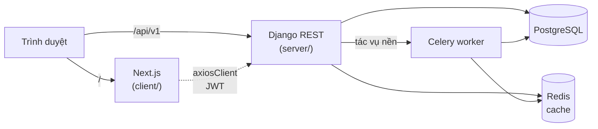

# Admin Template — Django + Next.js

Template quản trị (admin) full-stack dùng làm nền cho mọi dự án quản lý: **Django 5.2 LTS + DRF + PostgreSQL** ở backend, **Next.js 16 + Tailwind CSS v4 + shadcn/ui** ở frontend. Có sẵn đăng nhập, phân quyền RBAC động, quản lý người dùng, nhật ký thao tác, tệp đính kèm, xuất/nhập Excel, đa ngôn ngữ vi/en, giao diện sáng/tối, tìm kiếm toàn cục và công cụ sinh phân hệ CRUD — clone về là viết tính năng riêng.

**Tác giả:** ERICSS — GitHub [@nguyenphat006](https://github.com/nguyenphat006)

| Tài liệu | Nội dung |
|---|---|
| [`docs/TEMPLATE.md`](docs/TEMPLATE.md) | Clone, đổi thương hiệu, sinh module, bỏ module mẫu, deploy |
| [`docs/GLOBAL_SEARCH.md`](docs/GLOBAL_SEARCH.md) | Tìm kiếm toàn cục (Ctrl K): luồng, RBAC, thêm nguồn tìm |
| [`server/README.md`](server/README.md) | Backend: cấu trúc, cấu hình, API, phân quyền, test |
| [`client/README.md`](client/README.md) | Frontend: cấu trúc, lớp API, theme, quy ước component |
| [`CLAUDE.md`](CLAUDE.md) · [`AGENTS.md`](AGENTS.md) | Quy chuẩn cho AI agent (Claude Code / agent khác) |

---

## 1. Phân hệ có sẵn

### 1.1 Lõi hệ thống (giữ lại ở mọi dự án)

| Phân hệ | Route | Nội dung |
|---|---|---|
| Tổng quan | `/` | Dashboard KPI theo quyền, trạng thái hệ thống thật (DB, Redis, Celery) |
| Người dùng | `/users`, `/users/[id]` | CRUD, khóa/mở hàng loạt, nhập/xuất Excel, gán vai trò, trang hồ sơ chi tiết |
| Phân hệ & phân quyền | `/settings/modules` | ModuleRegistry (menu động), vai trò, ma trận quyền |
| Cấu hình hệ thống | Cài đặt | Tên ứng dụng, logo, đơn vị sở hữu, múi giờ, định dạng ngày/số (bảng `SystemSettings`) |
| Nhật ký thao tác | `/audit-logs` | Lịch sử thay đổi tự động bằng `django-pghistory` (trigger PostgreSQL) |
| Hồ sơ cá nhân | `/profile` | Thông tin cá nhân, đổi mật khẩu |
| Dùng chung | — | Tệp đính kèm đa hình + xem trước PDF/Word/Excel/ảnh, xuất Excel chạy nền (Celery) có theo dõi tiến độ, thông báo (chuông), tìm kiếm toàn cục |

### 1.2 Phân hệ mẫu (danh mục — tham khảo cách viết, xóa được)

| Phân hệ | Route | App backend | Điểm đáng tham khảo |
|---|---|---|---|
| Đơn vị tính | `/master-data/units` | `master_data` | CRUD chuẩn nhỏ nhất — mẫu để sao chép |
| Nhóm nguyên vật liệu | `/master-data/material-categories` | `master_data` | Danh mục phân cấp |
| Nguyên vật liệu | `/master-data/materials`, `/[id]` | `master_data` | Sinh mã tự động, bảng 1-1 (quy cách kim loại), trang chi tiết `DetailPage` |
| Khách hàng | `/master-data/customers` | `customers` | Chọn quốc gia ISO có cờ, tải logo, lọc nhiều giá trị |
| Nhà cung cấp | `/master-data/suppliers` | `suppliers` | Sinh hoàn toàn bằng `startmodule` + `gen:module` |

`server/database.dbml` còn giữ thiết kế nghiệp vụ sản xuất (sản phẩm, biến thể, BOM...) của dự án gốc làm ví dụ thiết kế CSDL — **chưa có code**, xóa hoặc thay bằng thiết kế của dự án mới.

## 2. Tính năng nền tảng

| Nhóm | Tính năng |
|---|---|
| **Tài khoản** | Đăng nhập JWT (access + refresh, tự làm mới), đăng xuất (blacklist token) |
| **Phân quyền RBAC** | Phân hệ → quyền (`<MODULE>_VIEW/READ/CREATE/UPDATE/DELETE/EXPORT/IMPORT`) → vai trò; menu sidebar, nút thao tác, kết quả tìm kiếm tự lọc theo quyền |
| **Danh sách** | `ListPage`: tìm kiếm / lọc theo cột / sắp xếp / phân trang trên URL, ẩn hiện cột, thao tác hàng loạt, xuất Excel |
| **Chi tiết & form** | `DetailPage` (hero + tab + đính kèm + nhật ký), `FormDialog` (react-hook-form, gắn lỗi backend vào ô nhập) |
| **Đa ngôn ngữ** | vi / en ở cả frontend (next-intl) và backend (gettext); CI chặn khóa thiếu |
| **Giao diện** | Sáng / tối / theo hệ thống, sidebar thu gọn + ngăn kéo trên điện thoại, trang 404 / lỗi / loading |
| **Nền tảng API** | Response thống nhất `{success, message, data, errors, code}`, `BaseERPViewSet` (CRUD + batch + export), factory service/hook, kiểu TypeScript sinh từ OpenAPI |
| **Công cụ** | `startmodule` + `gen:module` sinh phân hệ CRUD hoàn chỉnh; `bootstrap` khởi tạo hệ thống |
| **Chất lượng** | Test Django, Vitest, Playwright; CI GitHub Actions; Dependabot (2 PR mỗi đầu tháng: frontend + backend) |
| **Vận hành** | Docker production (nginx + gunicorn + Next standalone), health check |

## 3. Công nghệ

| Tầng | Công nghệ |
|---|---|
| Frontend | Next.js 16 (App Router, Turbopack) · React 19 · TypeScript · Tailwind CSS 4 · shadcn/ui (Radix) · react-hook-form · TanStack Query 5 · Zustand 5 · next-intl · Axios · SheetJS · recharts |
| Backend | Python 3.12 · Django 5.2 LTS · DRF · SimpleJWT · drf-spectacular · django-filter · django-pghistory · Celery · openpyxl · Pillow |
| Dữ liệu | PostgreSQL 16 (Docker hoặc Neon — không hỗ trợ SQLite) · Redis 7 (cache quyền + hàng đợi Celery) |
| Vận hành | Docker Compose · nginx · gunicorn · whitenoise · GitHub Actions · Dependabot · Playwright |

## 4. Kiến trúc



- **Hợp đồng API**: backend sinh `server/schema.yml` (OpenAPI) → frontend sinh kiểu `client/src/types/api.generated.ts` (`npm run gen:api`).
- **Production**: nginx là cổng vào duy nhất (`/api`, `/admin`, `/static` → Django; `/media` → file upload; còn lại → Next.js).

## 5. Cấu trúc thư mục

```text
template-Django-Nextjs/
├── server/                     # Backend Django — xem server/README.md
│   ├── apps/
│   │   ├── core/               #   Lõi: AuditModel, BaseERPViewSet, response, quyền, đính kèm, job nền, tìm kiếm, startmodule
│   │   ├── authentication/     #   Người dùng, vai trò, quyền, phân hệ/menu, JWT, seed_core/bootstrap
│   │   ├── audit/              #   API nhật ký thao tác
│   │   ├── dashboard/          #   API trang Tổng quan
│   │   ├── master_data/        #   Module MẪU: Đơn vị tính, Nhóm NVL, Nguyên vật liệu
│   │   ├── customers/          #   Module MẪU: Khách hàng
│   │   └── suppliers/          #   Module MẪU: Nhà cung cấp
│   ├── config/                 #   settings, urls, celery
│   ├── database.dbml           #   Thiết kế CSDL — nguồn chuẩn duy nhất
│   └── schema.yml              #   OpenAPI sinh tự động
├── client/                     # Frontend Next.js — xem client/README.md
│   ├── src/                    #   app/ (route), modules/ (tính năng), components/, lib/api/, stores/...
│   ├── messages/               #   Chữ hiển thị vi / en
│   ├── scripts/                #   gen-module.mjs + khuôn module
│   └── e2e/                    #   Smoke test Playwright
├── deploy/nginx.conf           # Cổng vào production
├── docker-compose.yml          # Dev: api, db, redis, celery_worker
├── docker-compose.prod.yml     # Production
├── .github/                    # CI + Dependabot
├── .claude/ · .agents/         # Rules & skills cho AI agent
└── docs/                       # Hướng dẫn template, thiết kế RBAC, tìm kiếm
```

## 6. Chạy nhanh (dev)

Yêu cầu: Docker Desktop, Python 3.12, Node.js 22+ (npm ≥ 10).

```bash
# 1. Biến môi trường
cp server/.env.example server/.env
cp client/.env.example client/.env.local

# 2. Backend (Postgres + Redis + Django + Celery trong Docker)
docker compose up -d
docker compose exec api python manage.py bootstrap --demo   # migrate + dữ liệu lõi + dữ liệu mẫu + tài khoản admin

# 3. Frontend
cd client && npm install && npm run dev
```

| Địa chỉ | Mô tả |
|---|---|
| http://localhost:3000 | Giao diện quản trị |
| http://localhost:8000/api/schema/swagger-ui/ | Tài liệu API (Swagger) |
| http://localhost:8000/api/v1/health/ | Trạng thái hệ thống |

Tài khoản mặc định: `admin` / mật khẩu trong `ADMIN_PASSWORD` (dev bỏ trống → `Admin@123456`).

> **Windows đã cài sẵn PostgreSQL** (chiếm cổng 5432) sẽ báo `password authentication failed`: dừng service đó hoặc đổi cổng map của `db` (vd `55432:5432`) rồi sửa `DATABASE_URL`.

## 7. Lệnh thường dùng

| Việc | Lệnh |
|---|---|
| Khởi tạo hệ thống | `python manage.py bootstrap [--demo]` |
| Cập nhật quyền sau khi thêm module | `python manage.py seed_core` |
| Sinh phân hệ CRUD | `python manage.py startmodule <app> <Model> --label "..." --route nhom/duong-dan` → `npm run gen:api` → `npm run gen:module -- --entity <Model> --label "..." --route nhom/duong-dan` |
| Test backend | `docker compose exec -e TEST_DATABASE_URL=postgres://postgres:postgres@db:5432/app_db api python manage.py test` |
| Kiểm tra frontend | `npx tsc --noEmit` → `npm run lint -- --max-warnings=0` → `npm test` → `npm run build` |
| Smoke test giao diện | `E2E_BASE_URL=http://localhost:3000 E2E_PASSWORD=... npm run test:e2e` |
| Production | `docker compose -f docker-compose.prod.yml --env-file .env.prod up -d --build` |

## 8. Quy chuẩn chung của template

Bộ rules đặt ở **`.claude/rules/`** (Claude Code, nạp theo đường dẫn) và **`.agents/rules/`** (agent khác, mục lục ở `AGENTS.md`) — hai bộ luôn cập nhật song song.

| Rule | Nội dung chính |
|---|---|
| `workflow.md` | Phê duyệt trước khi code, quy trình đổi schema, cập nhật rules |
| `backend-django.md` | App theo domain, `AuditModel` (soft delete + audit), `BaseERPViewSet`, chống N+1, transaction, bẫy đã gặp |
| `security-rbac.md` | Quyền module fail-closed, tài khoản admin, tệp đính kèm |
| `frontend-architecture.md` | Module theo tính năng, TanStack Query, factory service/hook, bẫy đã gặp |
| `frontend-forms.md` · `frontend-tables.md` · `frontend-detail-views.md` | `FormDialog`, `ListPage`, `DetailPage` |
| `frontend-ux.md` | UI gọn, thang khoảng cách 4/8, chỉ tải dữ liệu đang hiển thị |
| `frontend-i18n.md` | Không viết cứng chữ; vi là nguồn chuẩn, en phải khớp khóa |
| `testing.md` | Chọn công cụ test: Django TestCase · Vitest · Playwright |

Nguyên tắc cốt lõi:
1. **DBML trước, code sau** — mọi bảng/cột mới được chốt trong `server/database.dbml`.
2. **Health check trước khi báo xong** — backend: `makemigrations` → `migrate` → `check`; frontend: `tsc` → `lint --max-warnings=0` → `build`.
3. **Không tự thêm tính năng ngoài yêu cầu.**
4. **Conventional Commits** (`feat(scope): ...`, `fix(...)`, `docs(...)`).

## 9. Tác giả

**ERICSS** — GitHub [@nguyenphat006](https://github.com/nguyenphat006)

Giấy phép: [MIT](LICENSE).
